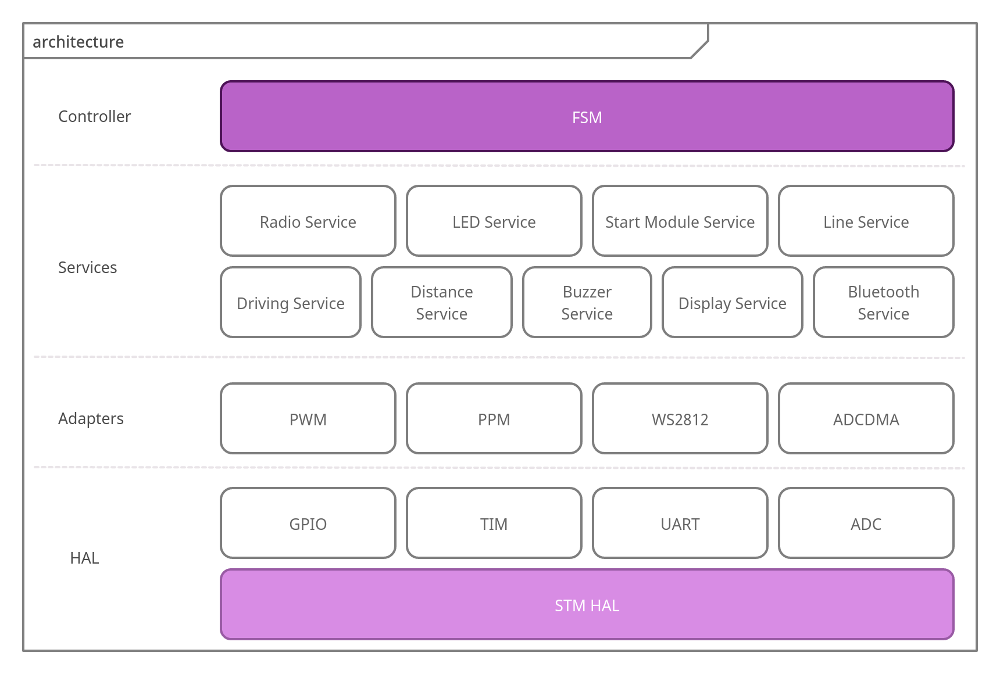
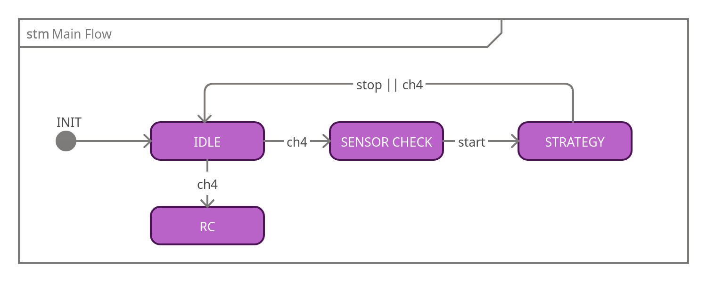

# Raijū
[](https://github.com/team-raiju/raiju-cpp/actions/workflows/build.yml)


-----

## ⚡ Introduction

Raiju is an autonomous/RC sumo robot, this project contains it's firmware in C++ for STM32F1 (ARM)

### 🏗️ Architecture

The project uses a layered architecture where upper layers do more compex tasks, using lower layers.

- HAL: Hardware Abstraction Layer - plain wrapper of STM's HAL in C++
- Adapters: More specialized HAL wrappers for specific devices
- Services: Uses HAL and Adapters for more complex, but specific tasks
- Controllers: The project state machine and all logic happens on this layer, instantiating and orchestrating every service



### 🧠 State Machine

The project uses a very simple State Machine, controlled with channel 4 from the radio and with the start module



-----

## 📂 Project Structure 

```
├── cube      # STM32Cube .ioc file and all cube generated files goes here
├── docs      # Assets for this readme
├── hal       # HAL layer is implemented here
├── inc       # Include files for adapters, services and controllers
├── scripts   # Helper scripts for building, generating cube files and flashing the uC
├── src       # Source files for adapters, services and controllers
└── ui        # UI files for Nextion's display
```

---

## 💻 Code


---

## Building

This repository supports VS Code for Containers, install the extension and reopen the project in the container,
this will build a container with arm-gcc, stm32cubemx, cmake and other tools needed to run the project. Run 
`bash scripts/cube.sh` from within the container, then build the project with cmake's extension build button (or run
`bash scripts/build.sh`, note that this will regenerate cube files too everytime)

